  

<h1 align="center">azure-help</h1>

<b>Hard-won playbooks for the non-obvious corners of Azure.</b> Things in the Azure portal that turned out to be painful, inconsistent or flaky — written down so they don't have to be rediscovered from scratch.

---

## Why this exists

Azure's billing and support flows are occasionally inconsistent enough that it's worth recording the **exact working steps** rather than relearning them each time. These notes come from filing real requests, dead ends included.

## In here

### 💸 Requesting a refund / credit

  

[**`refund-request-process.md`**](./refund-request-process.md) — how to get a refund or credit for an Azure billing charge, including:

- where the invoice actually lives;
- the self-service refund tool's **hidden "expedited refund" limit**;
- filing a support ticket as a **Credit request** instead, and the **"Solutions" self-help trap** that sends you in a circle (plus a broken link in the wizard);
- how to confirm it worked, and known flakiness to expect.

## License

MIT. See [LICENSE](LICENSE).

<!-- org-footer -->
---

Part of <a href="https://github.com/ry-ops">ry-ops</a> · building the pipes between infrastructure, automation, and observability · built by <a href="https://github.com/ry-ops">ry-ops</a>

